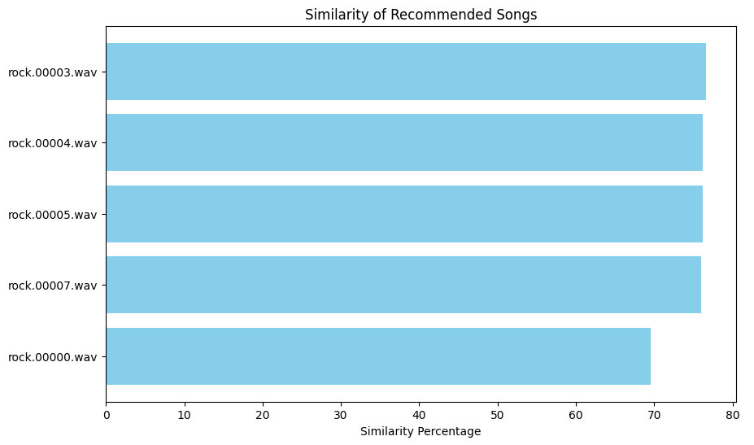

# GTZAN - Audio Analysis, Classification & Recommendations

## Table of Contents
1. [Overview](#overview)
2. [Audio Analysis](#audio-analysis)
   - [Harmonic and Percussive Components Analysis](#harmonic-and-percussive-components-analysis)
   - [MFCC Analysis](#mfcc-mel-frequency-cepstral-coefficients-analysis)
   - [Chroma Feature Analysis](#chroma-feature-analysis)
   - [Spectrogram Analysis](#spectrogram-analysis)
3. [Audio Classification](#audio-classification)
   - [XGBoost vs YAMNet](#xgboost-vs-yamnet)
4. [KNN Music Recommendation System](#knn-music-recommendation-system)

# Overview
Aim of this project is to do audio classification and analysis using the [GTZAN](https://www.kaggle.com/datasets/andradaolteanu/gtzan-dataset-music-genre-classification/code) dataset, as well as to build a music recommendation system.
This involves processing and extracting key features from audio signals to gain insights into musical structure and improve classification accuracy. Goal is to understand how different music genres exhibit unique frequency and temporal characteristics, leading to better genre recognition and recommendations.

# Audio Analysis

## Harmonic and Percussive Components Analysis
The Harmonic–Percussive Source Separation (HPSS) technique decomposes an audio signal into two layers:
- Harmonic (Blue) – Sustained, tonal elements (vocals, guitar chords, string sections).
- Percussive (Orange) – Rhythmic, transient elements (drum hits, sharp attacks).

### Insights from HPSS Analysis
- Classical and jazz tend to have smooth harmonic content, with minimal percussive elements.
- Hip-hop and Rock often exhibit strong percussive spikes due to heavy drum usage.
- Metal music displays both intense percussive elements and sustained harmonic components.

## MFCC (Mel-Frequency Cepstral Coefficients) Analysis
MFCCs are a representation of the short-term power spectrum of a sound, based on a linear cosine transform of a log power spectrum on a nonlinear mel scale of frequency.

**How MFCCs Work?**  
1. The audio signal is divided into short frames (20-40 ms).
2. Fourier Transform (FFT) converts the signal from time-domain to frequency-domain.
3. The frequency spectrum is mapped to the mel scale, approximating human hearing perception.
4. The logarithm is applied to mimic the human ear's non-linear sensitivity to loudness.
5. Discrete Cosine Transform (DCT) is used to extract key MFCC features.

### Insights from MFCCs
- Each genre has a unique "fingerprint" in its MFCCs, which reflects its musical characteristics (rhythm, harmony, timbre). Rock and metal might have more pronounced high-frequency components, while classical and jazz might have smoother transitions.
- The plots show how the audio features change over time. For instance, a sudden change in color intensity might indicate a transition between sections of the song.
- We can identify similarities (blues and jazz might share some patterns) and differences (classical and metal are likely very distinct).

## Chroma Feature Analysis
Chroma features represent the harmonic and melodic characteristics of a musical piece. They are useful for analyzing chord progressions, tonality, and musical key detection.

**How it works?**  
1. The audio signal is analyzed to identify the pitch content across the frequency spectrum.
2. Frequencies are mapped to their corresponding pitch classes, effectively "folding" all octaves into a single octave (for example, C2, C3, and C4 are all treated as "C").
3. The energy (magnitude) within each pitch class is summed up, resulting in a 12-dimensional vector representing the chroma features.

### Insights from Chroma Features
- The transitions between pitch classes over time can reveal chord progressions. For example, a sequence of bright spots moving vertically might indicate a chord change.
- Genres like rock, blues, pop, and hip-hop show dense chroma activity, indicating frequent chord changes.
- Classical and jazz have more structured patterns (jazz is showing more harmonic complexity).
- The pitch class with the highest intensity over time often indicates the tonal center (key) of the music.

## Spectrogram Analysis
A spectrogram represents the frequency content of a signal over time. It helps to visualize how different frequencies evolve throughout the duration of the audio clip.

### Insights from Spectrogram Analysis

| Genre      | Low Frequencies (Bass/Drums) | Mid Frequencies (Guitar/Piano) | High Frequencies (Vocals/Percussion) | Density & Variation |
|------------|-----------------------------|---------------------------------|---------------------------------|-------------------|
| **Rock**   | Strong          | High      | Present, less prominent     | Dense  |
| **Country**| Moderate        | Strong    | Present, less percussive    | Structured |
| **Classical** | Low          | Strong    | Strong                      | Highly structured |
| **Hip-Hop** | Strong         | Moderate  | Sparse, rhythmic           | Repetitive |
| **Blues**  | Moderate       | Smooth    | Moderate, rhythmic         | Improvised |
| **Pop**    | Balanced       | Present, cleaner than rock | Present, bright | Repetitive |
| **Reggae** | Strong         | Present, rhythmic stabs   | Moderate         | Offbeat structure |
| **Jazz**   | Variable       | High      | Present, dynamic changes   | Highly varied |
| **Disco**  | Moderate       | Present, rhythmic        | Present, bright  | Rhythmic, consistent |
| **Metal**  | Strong         | Strong, distorted       | Harsh, intense   | Dense, aggressive |

# Audio Classification
The audio features are extracted from audio files and they are saved as CSV files for further processing. We use XGBoost and YAMNet for genre classification because they offer complementary strengths in analyzing and classifying audio signals.

## XGBoost vs YAMNet
**XGBoost** is an ensemble learning method that builds a series of decision trees sequentially. Each tree corrects the errors of the previous one, leading to a highly accurate model. Since our extracted audio features are structured and numeric, XGBoost is well-suited to classify them effectively and outperform many other machine learning models.  

**YAMNet** is a pre-trained deep learning model based on the MobileNet architecture designed for audio classification. Instead of training a model from scratch to understand raw audio, we use YAMNet as a feature extractor, converting audio waveforms into meaningful feature representations.  

XGBoost outperformed YAMNet in terms of accuracy on the dataset, while YAMNet tends to overfit easily, even with fine-tuning.

| Genre     | YAMNet Precision | YAMNet Recall | YAMNet F1-score | XGBoost Precision | XGBoost Recall | XGBoost F1-score |
|-----------|-----------------|--------------|----------------|-------------------|--------------|----------------|
| Rock      | 0.70            | 0.80         | 0.74           | 0.91              | 0.84         | 0.87           |
| Country   | 0.94            | 0.80         | 0.86           | 0.81              | 0.87         | 0.84           |
| Classical | 0.95            | 1.00         | 0.98           | 0.93              | 0.97         | 0.95           |
| Hip-Hop   | 0.89            | 0.85         | 0.87           | 0.96              | 0.90         | 0.93           |
| Metal     | 0.95            | 0.95         | 0.95           | 0.94              | 0.96         | 0.95           |
| **Overall Accuracy** | **0.86** | | | **0.91** | |

# KNN Music Recommendation System
The KNN algorithm is used for implementing a music recommendation system. It can recommends songs based on similarity measured between feature vectors extracted from audio files. Instead of using Euclidean distance, we will go for a Cosine distance (it better captures feature vector relationships in high-dimensional space).

**How it Works**  
1. Extract MFCCs, Chroma Features, and Spectral Features from the dataset.
2. Normalize and scale the feature vectors using StandardScaler.
3. Train a model using cosine distance.
4. For a given input song, find the K nearest songs based on their cosine distance.
5. Recommend the most similar songs to the user, ranking them by similarity percentage.

## Recommendation Example

